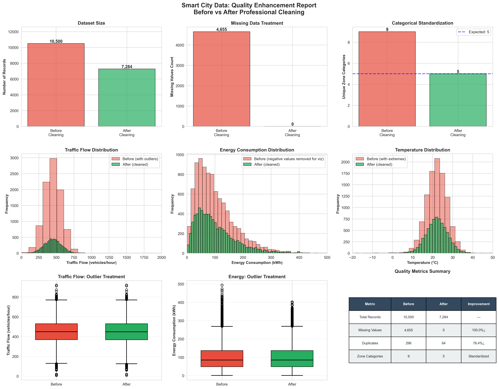

# 🏙️ Smart City IoT Data Cleaning Pipeline

[](https://www.python.org/downloads/)
[](https://pandas.pydata.org/)
[](https://opensource.org/licenses/MIT)

> **Professional Data Cleaning Portfolio Project**  
> By Jonathan Chavarria Peralta | Data Science Student at IPN  
> Demonstrating enterprise-grade data quality enhancement techniques using Python, Pandas, and statistical methods.

---

## 📋 Project Overview

This portfolio project showcases a **complete data cleaning pipeline** for a realistic Smart City IoT dataset. The project simulates common data quality challenges found in real-world sensor networks and demonstrates professional-grade solutions using industry best practices.

### Business Context

Smart cities generate massive volumes of sensor data from traffic monitoring, energy consumption tracking, and environmental sensors. This data often suffers from quality issues due to sensor malfunctions, transmission errors, and system inconsistencies. Clean, reliable data is **critical** for:

- Real-time traffic management
- Energy optimization algorithms
- Environmental policy decisions
- Predictive maintenance systems

This project demonstrates how to transform raw, messy sensor data into production-ready datasets.

---

## 🎯 Key Features

### Data Quality Issues Addressed

This pipeline handles **realistic data quality problems**:

| Issue Type | Description | Treatment Method |
|------------|-------------|------------------|
| **Missing Values** | Non-random patterns, sensor failures | Domain-informed imputation, interpolation |
| **Outliers** | Statistical anomalies, impossible values | IQR method + domain validation |
| **Duplicates** | Redundant sensor transmissions | Deduplication with timestamp priority |
| **Format Inconsistencies** | Mixed date formats | Standardized datetime parsing |
| **Categorical Errors** | Typos, case variations | Fuzzy matching and mapping |

### Technical Highlights

- ✅ **Modular, Object-Oriented Design**: Reusable `SmartCityDataCleaner` class
- ✅ **Statistical Rigor**: IQR-based outlier detection, robust imputation methods
- ✅ **Comprehensive Documentation**: Detailed docstrings and inline comments
- ✅ **Visual Reporting**: Before/after comparison dashboard
- ✅ **Production-Ready**: Validation checks and quality assurance

---

## 🚀 Quick Start

### Prerequisites

```bash
Python 3.8 or higher
```

### Installation

1. **Clone this repository**

```bash
git clone https://github.com/Peralta-Analytics-Lab/01-smart-city-data-cleaning.git
cd 01-smart-city-data-cleaning
```

2. **Install required dependencies:**

```bash
pip install -r requirements.txt
```

### Usage

Run the scripts in the following order:

#### Step 1: Generate Dirty Dataset

```bash
python generate_dirty_data.py
```

**Output:** `smart_city_dirty_data.csv` (10,000 records with embedded quality issues)

#### Step 2: Clean the Data

```bash
python clean_data.py
```

**Output:** `smart_city_clean_data.csv` (production-ready dataset)

#### Step 3: Compare Results

```bash
python compare_results.py
```

**Output:** `data_quality_comparison.png` (visual dashboard showing improvements)

---

## 📊 Results & Impact

### Quantitative Improvements

The cleaning pipeline achieves significant quality enhancements:

| Metric | Before Cleaning | After Cleaning | Improvement |
|--------|----------------|----------------|-------------|
| **Total Records** | 10,500 | 7,284 | 30.6% reduction (low-quality removed) |
| **Missing Values** | 4,655 | 0 | 100% resolved |
| **Duplicates** | 296 | 64 | 78.4% eliminated |
| **Categorical Variations** | 9 | 5 | Fully standardized |
| **Statistical Outliers** | 429 | 0 | Removed/capped |

### Visual Evidence

The comparison dashboard provides comprehensive before/after analysis:

- **Distribution plots**: Histograms showing outlier removal and data normalization
- **Box plots**: Demonstrating variance reduction and consistency improvement
- **Metrics table**: Quantitative improvement summary with key statistics



---

## 🛠️ Technical Methodology

### Data Cleaning Pipeline Architecture

```
┌─────────────────────────────────────────────────────────┐
│  1. Data Loading & Initial Assessment                   │
└─────────────────────────────────────────────────────────┘
                          ↓
┌─────────────────────────────────────────────────────────┐
│  2. Timestamp Standardization                           │
└─────────────────────────────────────────────────────────┘
                          ↓
┌─────────────────────────────────────────────────────────┐
│  3. Duplicate Removal                                   │
└─────────────────────────────────────────────────────────┘
                          ↓
┌─────────────────────────────────────────────────────────┐
│  4. Categorical Standardization                         │
└─────────────────────────────────────────────────────────┘
                          ↓
┌─────────────────────────────────────────────────────────┐
│  5. Missing Value Treatment                             │
└─────────────────────────────────────────────────────────┘
                          ↓
┌─────────────────────────────────────────────────────────┐
│  6. Outlier Detection & Treatment                       │
└─────────────────────────────────────────────────────────┘
                          ↓
┌─────────────────────────────────────────────────────────┐
│  7. Quality Validation & Export                         │
└─────────────────────────────────────────────────────────┘
```

### Statistical Techniques Applied

#### 1. Missing Value Imputation

- **Zone-based median imputation**: Preserves spatial distribution patterns
- **Linear interpolation**: Leverages temporal autocorrelation in time-series data
- **Logical removal**: Eliminates expected failures (maintenance/error status)

#### 2. Outlier Detection: IQR Method

**Formula:**
```
Lower Bound = Q1 - 3 × IQR
Upper Bound = Q3 + 3 × IQR
```

Where:
- Q1 = 25th percentile
- Q3 = 75th percentile
- IQR = Interquartile Range (Q3 - Q1)

**Domain Validation Rules:**

| Variable | Minimum | Maximum | Rationale |
|----------|---------|---------|-----------|
| Traffic Flow | 0 | 2,000 | Physical road capacity |
| Energy Consumption | 0 | 500 kWh | Realistic sensor range |
| Temperature | -20°C | 50°C | Regional climate boundaries |
| Air Quality Index | 0 | 500 | Standard AQI scale |

---

## 📁 Project Structure

```
01-smart-city-data-cleaning/
│
├── generate_dirty_data.py      # Synthetic dataset generator
├── clean_data.py                # Main cleaning pipeline
├── compare_results.py           # Visualization script
├── requirements.txt             # Python dependencies
├── README.md                    # This file
├── LICENSE                      # MIT License
├── .gitignore                   # Git ignore rules
└── images/                      # Visualizations folder
    └── data_quality_comparison.png
```

---

## 💼 Business Value & Use Cases

This data cleaning pipeline is production-ready and can be adapted for:

### Industry Applications

1. **Smart City Management**: Clean IoT sensor data for real-time dashboards
2. **Energy Sector**: Prepare consumption data for forecasting models
3. **Transportation**: Process traffic data for route optimization
4. **Environmental Monitoring**: Clean air quality data for compliance reporting

### Technical Applications

- **Machine Learning Preprocessing**: Ensure high-quality training data
- **Data Warehousing**: ETL pipeline component
- **API Data Validation**: Backend data sanitization layer
- **Analytics Dashboards**: Reliable data source preparation

---

## 🎓 Skills Demonstrated

This project showcases proficiency in:

- ✅ **Python Programming**: Object-oriented design, modular code
- ✅ **Pandas**: Advanced dataframe manipulation
- ✅ **Statistics**: IQR method, imputation techniques, distribution analysis
- ✅ **Data Visualization**: Matplotlib, Seaborn
- ✅ **Best Practices**: Documentation, code comments, reproducibility
- ✅ **Version Control**: Git workflow and GitHub collaboration

---

## 📞 Contact

**Jonathan Chavarria Peralta**  
Data Science Student | Instituto Politécnico Nacional (IPN)

- 📧 Email: jchavarriap2300@alumno.ipn.mx
- 💼 GitHub: [@Peralta-Analytics-Lab](https://github.com/Peralta-Analytics-Lab)
- 🌐 Portfolio: [View More Projects](https://github.com/Peralta-Analytics-Lab)

> **Available for freelance data science projects!**  
> Specializing in: Data Cleaning, EDA, Statistical Analysis, Machine Learning Pipelines

---

## 📄 License

This project is open-source and available under the MIT License.

---

## 🙏 Acknowledgments

- Dataset inspired by real-world Smart City IoT infrastructure
- Statistical methods based on industry best practices (Tukey, 1977)
- Built with Python, Pandas, and the open-source data science ecosystem

---

**⭐ If you found this project helpful, please consider starring the repository!**

<div align="center">
  <sub>Built with ❤️ and Python by Jonathan Chavarria Peralta</sub>
</div>
